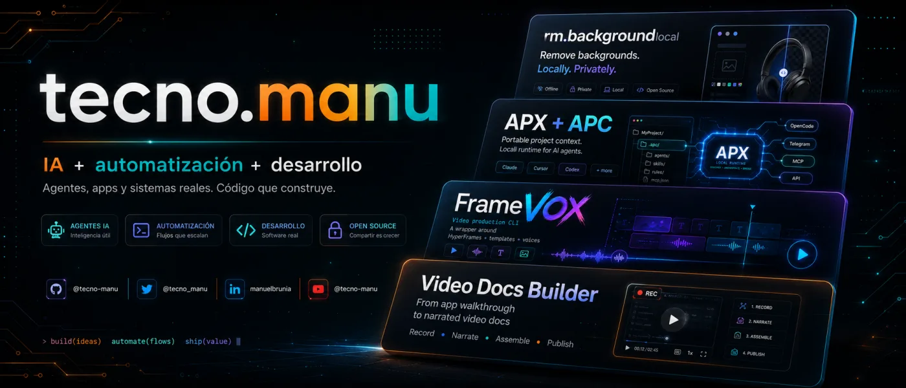

# Hi, I'm Manu (TecnoManu)

**Tech Lead at Bytetravel / Globely. Backend-first full-stack developer building AI tooling, MCP servers, ChatGPT Apps, and open-source utilities.**

I work mostly with **PHP, Laravel, TypeScript, JavaScript, Python, NestJS, FastAPI, Docker, MCP, APC/APX, and AI agents**.

Right now I care most about:

- shared project context for AI-assisted teams
- agent workflows that stay practical and controllable
- MCP servers and ChatGPT Apps
- Laravel/backend systems, APIs, queues and integrations
- video automation for docs and social publishing
- local-first AI tools

[](https://github.com/tecnomanu)
[](https://www.linkedin.com/in/manuelbrunia/)
[](https://www.instagram.com/tecno.manu/)
[](https://www.tiktok.com/@tecno.manu)

---

## Now building

### APC - Agent Project Context

I'm pushing **APC (Agent Project Context)**: an open convention for storing durable AI project context in a shared `.apc/` folder.

The idea is simple:

> one project, one shared context layer.

APC helps teams avoid duplicating context across `.claude/`, `.cursor/`, `.codex/`, `.opencode/`, and other agent-specific folders.

- Web: https://agentprojectcontext.com/
- Repo: https://github.com/agentprojectcontext/agentprojectcontext

APC does not replace MCP. **APC organizes project context. MCP connects external tools.**

### APX

I'm also building around **APX**, a practical layer for operating agents, routines, MCPs, Telegram bridges, project tasks, and automation on top of shared project context.

Where APC is the portable context contract, APX is the execution and coordination layer I use to make agent work usable in real projects.

---

## Featured projects

### FrameVox

**FrameVox** is a video automation tool for creating publish-ready social videos with voice.

It is related to Video Docs Builder, but aimed more directly at producing short videos for social platforms: script, voice, visuals and export flow.

- Repo: https://github.com/tecnomanu/framevox

### Video Docs Builder

**Video Docs Builder** is an agent skill for generating narrated videos from web app flows.

It combines Playwright, TTS and FFmpeg to record browser interactions, narrate them and assemble synchronized `.mp4` videos. Useful for demos, onboarding, QA and living documentation.

- Repo: https://github.com/tecnomanu/video-docs-builder

### MCP Telegram Agent

**MCP Telegram Agent** is a TypeScript MCP server for sending Telegram notifications from AI agents.

It supports guided onboarding, config verification, `npx` execution and direct notification delivery from MCP-compatible clients.

- Repo: https://github.com/tecnomanu/mcp-telegram-agent

### Remove Background Local

Recent local-first AI utility for removing image backgrounds without uploading files to external servers.

It runs locally, has no API key requirement, supports batch processing, persistent sessions, multiple output formats, Electron desktop support and models like ISNet/BiRefNet.

- Repo: https://github.com/tecnomanu/remove-background-local
- npm: https://www.npmjs.com/package/remove-background-local

```bash
npx -y remove-background-local
npx -y remove-background-local@latest desktop install
```

### Work note: Bytetravel ChatGPT App

I worked on the **Bytetravel ChatGPT App**, published in the ChatGPT Apps directory.

- App: https://chatgpt.com/apps/bytetravel/asdk_app_69cbfe8a08cc819189985005d12166e1
- Current work: **Tech Lead at Globely**, a Bytetravel project.

---

## MCP and agent tooling

- [Agent Rules Kit](https://github.com/tecnomanu/agent-rules-kit) - CLI for scaffolding agent rules and MCP-ready guidance.
- [Agent Rules Kit MCP](https://github.com/tecnomanu/agent-rules-kit-mcp) - companion MCP server for running rules from agents.
- [Puppeteer Server](https://github.com/tecnomanu/puppeteer-server) - safe-by-default browser automation through MCP.
- [MCP Telegram Agent](https://github.com/tecnomanu/mcp-telegram-agent) - Telegram notifications from AI agents.
- [Bootstrap Project MCP](https://github.com/tecnomanu/bootstrap-project-mcp) - guided project generation from templates.
- [PAMPA](https://github.com/tecnomanu/pampa) - semantic code memory and MCP-compatible search for repositories.

---

## Backend, Laravel and infrastructure

- [PHP8 FPM + Nginx + Supervisor](https://github.com/tecnomanu/docker-php8-laravel-nginx-supervisor) - optimized Alpine image for Laravel/Lumen.
- [PHP 7.4 Laravel variants](https://github.com/tecnomanu/docker-php74-laravel-nginx-supervisor)
- [PHP 7.4 + MongoDB](https://github.com/tecnomanu/docker-php74-mongodb-nginx-supervisor)
- [Multitenant NestJS API base](https://github.com/tecnomanu/multitenant-nestjs-api-base) - SaaS multi-tenant boilerplate with auth, seeds and DevOps tooling.
- [Panel base Angular + Lumen](https://github.com/tecnomanu/panel-base-frontend-api) - internal panel frontend/backend starter.

---

## Talks and demos

- **Nerdearla 2025** - MCP / n8n / AI demo with Carlos Pereyra.
- [Nerdearla Agenda MCP](https://github.com/tecnomanu/nerdearla-agenda-mcp) - real-time interactive agenda MCP server.
- Talk: https://www.youtube.com/watch?v=NKPeVDFvDys

---

## Contact

- GitHub: https://github.com/tecnomanu
- LinkedIn: https://www.linkedin.com/in/manuelbrunia/
- Instagram: https://www.instagram.com/tecno.manu/
- TikTok: https://www.tiktok.com/@tecno.manu
- Web: https://incubit.com.ar/

> Build fast. Ship simple. Keep context.
